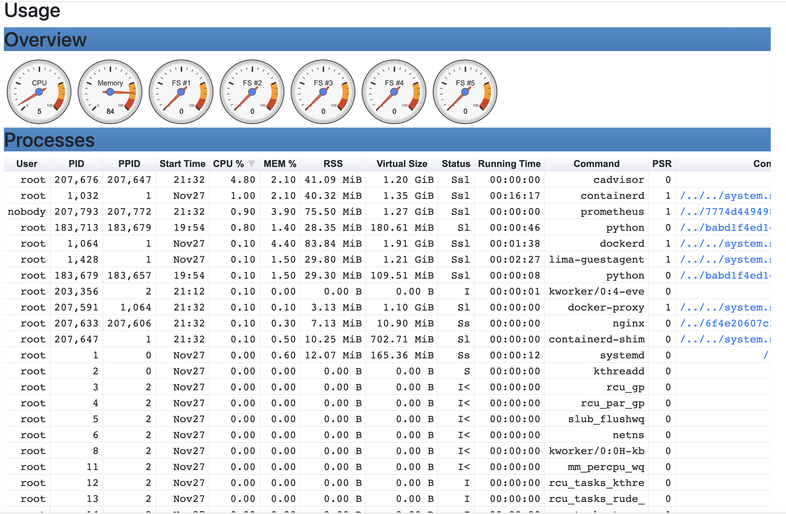

# Container Monitor
This utility can connect to a container to monitor its state. This is still WIP and thats why no more details at the moment.

## Prerequisites
- docker
- docker-compose
- bash

The script uses docker-compose to start and stop the monitoring services, so make sure you have docker and docker-compose installed on your system.

## Setup
- Clone the repo `git clone https://github.com/hrmeetsingh/ContainerMonitor.git`
- Run `cd ContainerMonitor`
- Run `chmod +x monitor.sh`
- Run `./monitor.sh start` to start monitoring
- Run `./monitor.sh stop` to stop monitoring
- Run `./monitor.sh logs <container_name>` to view logs from a container
- Run `./monitor.sh stream <container_name>` to stream logs from a container

Since the script abstracts the docker-compose file, you can modify the configuration as you see fit. It hides the complexity of docker-compose and provides a simple way to start and stop monitoring services.

## Screenshots 

Its probably an already solved problem. I am trying this in my free time to get understanding of the tools and the approach. 
The code is generated by Claude and I have tweaked it to suit my purpose, so I do not claim any credit for this
