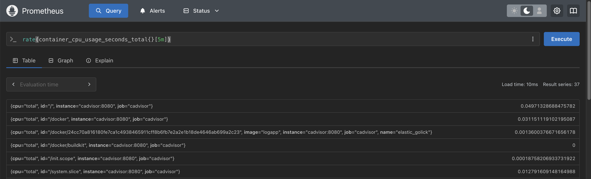

# Container Monitor

A utility to monitor the state of Docker containers using Prometheus and cAdvisor. This project provides simple scripts to start, stop, and query monitoring services, abstracting away the complexity of Docker Compose. **Note:** This project is a work in progress.

---

## Table of Contents
- [Prerequisites](#prerequisites)
- [Setup](#setup)
- [Usage](#usage)
- [Screenshots](#screenshots)
- [Queries](#queries)
- [Contributing](#contributing)
- [License](#license)

---

## Prerequisites
- Docker
- Docker Compose
- Bash

Ensure Docker and Docker Compose are installed on your system. The script uses Docker Compose to manage monitoring services.

## Setup
1. Clone the repository:  
   `git clone https://github.com/hrmeetsingh/ContainerMonitor.git`
2. Change directory:  
   `cd ContainerMonitor`
3. Make the script executable:  
   `chmod +x monitor.sh`

## Usage
- **Start monitoring:**  
  `./monitor.sh start`

- **Stop monitoring:**  
  `./monitor.sh stop`  

- **View container logs:**  
  `./monitor.sh logs <container_name>`  

- **Stream container logs:**  
  `./monitor.sh stream <container_name>`  

- **Query Prometheus:**  
  `./monitor.sh query <query>`  
  Runs a Prometheus query (see [Queries](#queries) section for examples).

You can modify the `docker-compose.yml` configuration as needed. The script provides a simplified interface for common monitoring operations.

## Screenshots


## Queries

**Common Prometheus Metrics:**

| Metric Name                          | Description                                 |
|--------------------------------------|---------------------------------------------|
| `container_cpu_usage_seconds_total`  | Total CPU time consumed by the container    |
| `container_memory_usage_bytes`       | Current memory usage of the container       |
| `container_network_receive_bytes_total` | Total bytes received over the network     |
| `container_network_transmit_bytes_total` | Total bytes transmitted over the network |
| `container_fs_usage_bytes`           | Filesystem usage in bytes                   |
| `container_fs_reads_total`           | Total filesystem reads                      |
| `container_fs_writes_total`          | Total filesystem writes                     |

**Example Aggregated Queries:**

- **CPU Usage Percentage**
  ```
  sum(rate(container_cpu_usage_seconds_total{container_label!=""}[5m])) by (container_label) * 100
  ```

- **Memory Usage Percentage**
  ```
  (container_memory_usage_bytes{container_label!=""} / container_spec_memory_limit_bytes{container_label!=""}) * 100
  ```

- **Top 5 Containers by CPU Usage**
  ```
  topk(5, sum(rate(container_cpu_usage_seconds_total[5m])) by (container_label))
  ```

- **Network Traffic Rate** - Shows the rate of incoming network traffic per container.
  ```
  rate(container_network_receive_bytes_total[5m])
  ```

- **Querying with command line**
    ```
    ./monitor.sh query "container_cpu_usage_seconds_total"
    ```

- **Querying with web interface**


## Contributing

Contributions, suggestions, and improvements are welcome! Please open an issue or submit a pull request.

## License

This project is for educational purposes. Portions of the code were generated with the help of AI tools and adapted for this project. Please see the LICENSE file for details.


